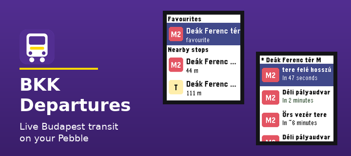
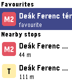
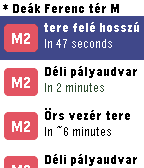
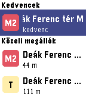
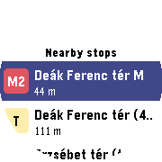

# BKK Departures

A Pebble watchapp showing nearby Budapest public transport stops and live
departures, powered by the [BKK FUTÁR open data API](https://opendata.bkk.hu/).






- **Nearby stops** based on your phone's GPS, each tagged with its mode —
  metro (M), tram (T), bus (B), trolleybus (O), HÉV/rail (H), ferry (F) —
  using the real BKK line colours on colour Pebbles.
- **Departures** per stop with a live countdown (`48s`, `3'`), updated every
  second on the watch. Realtime predictions are green; schedule-only times are
  prefixed with `~`.
- **Favourites**: long-press SELECT on a stop's departures screen to pin it to
  the home screen (stored on the watch, survives restarts). Long-press again
  to remove.
- **Buttons**: SELECT opens a stop / manually refreshes departures; BACK goes
  back. Departures auto-refresh (configurable) while the screen is open.

## Setup

1. Get a free API key: register at <https://opendata.bkk.hu> and request a
   key for the FUTÁR API.
2. Install the app on your watch (see below).
3. In the Pebble phone app, open the app's settings (gear icon) and paste
   your API key. You can also pick the search radius (default 400 m), the
   auto-refresh interval (default 60 s), and the app language (English or
   Magyar — the settings page itself follows the choice on the next launch).

The app is deliberately gentle on the API: one request in flight at a time,
identical requests deduplicated for 20 s, nearby-stop results cached for
2 minutes, and auto-refresh only runs while the departures screen is visible.

## Building & running

```sh
pebble build                          # build for all targetPlatforms
pebble install --emulator basalt      # run in an emulator
pebble install --phone <ip>           # install to a paired phone
```

Emulator notes: the emulator's fake GPS is not in Budapest, so set
`DEBUG_LOCATION` in `src/pkjs/index.js` to a Budapest coordinate for testing,
and enter your API key with `pebble emu-app-config --emulator basalt`.

## Project layout

```
src/c/pebble-bkk.c            App entry point
src/c/comm.{c,h}              AppMessage protocol with the phone
src/c/stops_window.{c,h}      Home screen: favourites + nearby stops
src/c/departures_window.{c,h} Departures list with live countdown
src/c/favorites.{c,h}         Persistent favourites store
src/c/transit_types.{c,h}     Vehicle-type badges and colours
src/pkjs/index.js             Phone side: GPS, BKK API, throttling/caching
src/pkjs/config.js            Settings page (Clay) definition
src/pkjs/vendor/pebble-clay.js Vendored Clay 1.0.4 (npm package lacks
                              flint/gabbro platform support)
```

## Documentation

SDK docs and API reference: <https://developer.repebble.com> ·
BKK FUTÁR OpenAPI spec: <https://opendata.bkk.hu/docs/futar-openapi.yaml>

## AI disclosure

This app was developed with the help of AI, using Claude Code (Fable 5 
and Opus 4.8).
